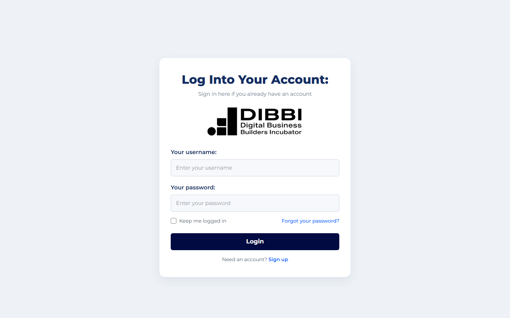
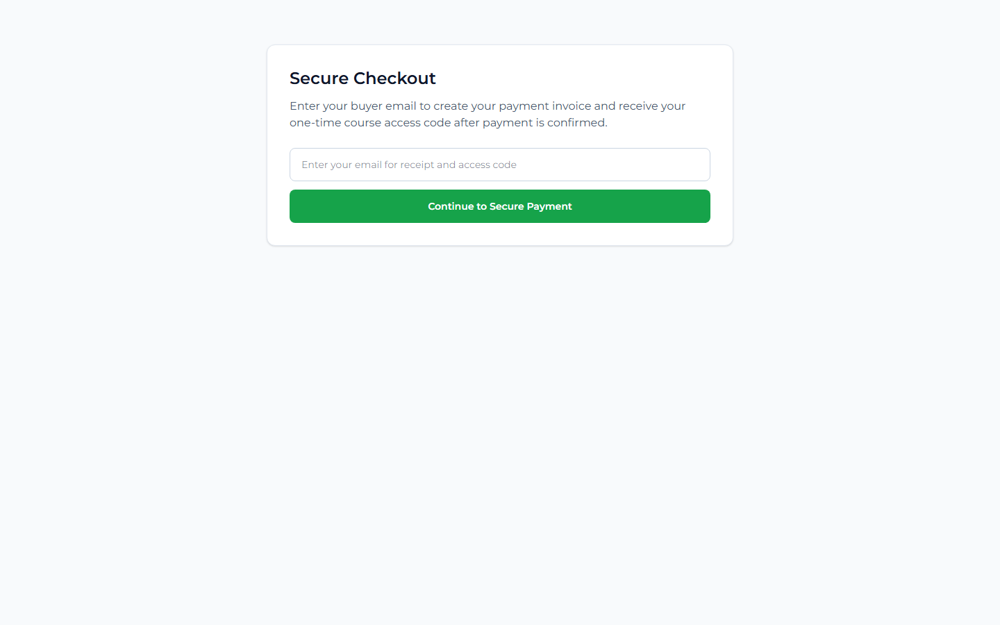

# CLG Onboarding

CLG Onboarding is a web-based course onboarding and certification platform for DIBBI's Certified Lead Generator training. It lets users purchase access, receive or redeem a course code, log in, view available courses, and track lesson progress.

## Overview

This system was created to guide new lead generators through a structured onboarding flow. It combines a public enrollment page, secure payment checkout, account access, course unlocking, and a private course dashboard so learners can move from purchase to training in one place.

## Features

- Public onboarding landing page for the Certified Lead Generator program.
- Xendit checkout flow for creating secure payment invoices.
- One-time access code redemption after payment confirmation.
- Supabase authentication for login and signup.
- Protected course dashboard with enrolled and explore tabs.
- Course lesson pages with lesson navigation and completion tracking.
- Progress indicators for courses and lessons.
- Email delivery support for course access codes through Resend.
- Supabase user import scripts for migrating legacy users from Excel data.

## System Purpose

The system solves the problem of manually onboarding trainees, collecting payments, issuing access, and tracking learning progress across separate tools. It gives users a guided path to enroll in the certification program and gives the platform a centralized way to manage course access and progress.

## Technologies Used

- Next.js 16
- React 19
- TypeScript
- Tailwind CSS
- Supabase
- Xendit API
- Resend email API
- XLSX for legacy Excel imports
- ESLint
- Node.js and npm

## Installation

1. Clone or download the project.
2. Install dependencies:

```bash
npm install
```

3. Create a local environment file:

```bash
cp .env.local.example .env.local
```

4. Add the required environment values in `.env.local`:

```bash
NEXT_PUBLIC_SUPABASE_URL=your_supabase_project_url
NEXT_PUBLIC_SUPABASE_ANON_KEY=your_supabase_anon_key
SUPABASE_SERVICE_ROLE_KEY=your_supabase_service_role_key
XENDIT_SECRET_KEY=your_xendit_secret_key
XENDIT_WEBHOOK_VERIFICATION_TOKEN=your_xendit_webhook_token
NEXT_PUBLIC_APP_URL=http://localhost:3000
RESEND_API_KEY=your_resend_api_key
RESEND_FROM_EMAIL="DIBBI <onboarding@example.com>"
```

5. Run the development server:

```bash
npm run dev
```

6. Open the app in your browser:

```bash
http://localhost:3000
```

## Usage

- Visit `/onboarding` to view the public onboarding page and start checkout.
- Visit `/pay` to open the standalone secure checkout page.
- Use `/login` or `/signup` to access an account.
- Use `/redeem-code` to redeem a one-time course access code.
- After login, visit `/courses` to view enrolled courses and explore available courses.
- Open a course page from the dashboard to view lessons and mark lessons as complete.

## Screenshots

### Onboarding Page


### Login Page



### Payment Page



## Author

Najeeb C. Mapantas
